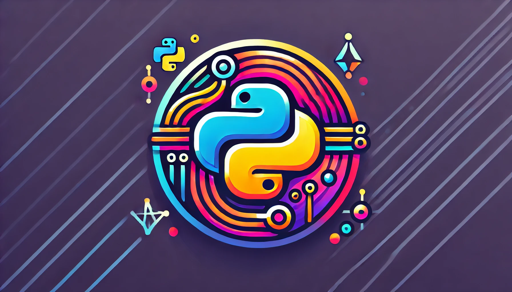

# GroLLM


**grollm** is a Python package that simplifies interactions with major Large Language Model (LLM) APIs, including OpenAI, Google Gemini, and Anthropic. It features easy-to-use wrappers and integrates with MLflow for detailed token usage tracking.

## Description

**grollm** is a powerful Python package that provides seamless wrappers for leading LLM APIs. Designed to streamline the development process, `grollm` abstracts the complexities of these APIs, allowing developers to integrate LLM functionalities with minimal effort.

Key features of `grollm` include:

- **Unified API Access**: Simplify your code by using consistent interfaces for different LLM providers.
- **Ease of Use**: Avoid the hassle of learning the specific details of each API. `grollm` handles the intricacies for you.
- **MLflow Integration**: Track and manage your token usage effectively with built-in MLflow support, enabling detailed monitoring of API consumption and cost.

## Installation

You can install `grollm` via pip:

```python
pip install grollm
```

## Getting Started

Create a .env file locally wherever you want to use this package

```python
# api key required to be used respective packages

OPENAI_API_KEY = "<openai-api-key>" #Optional
GEMINI_API_KEY = "<gemini-api-key>" #Optional
ANTHROPIC_API_KEY = "<claude-api-key>" #Optional
MLFLOW_DB_URI = "<mlflow-db-uri>" #Optional, to use ml flow. Leave blank if not required. Ex sqlite:///logs/mlflow.db
```
## For building package locally

You can install `hatchling` via pip:

```python
pip install hatchling
hatchling build
```
